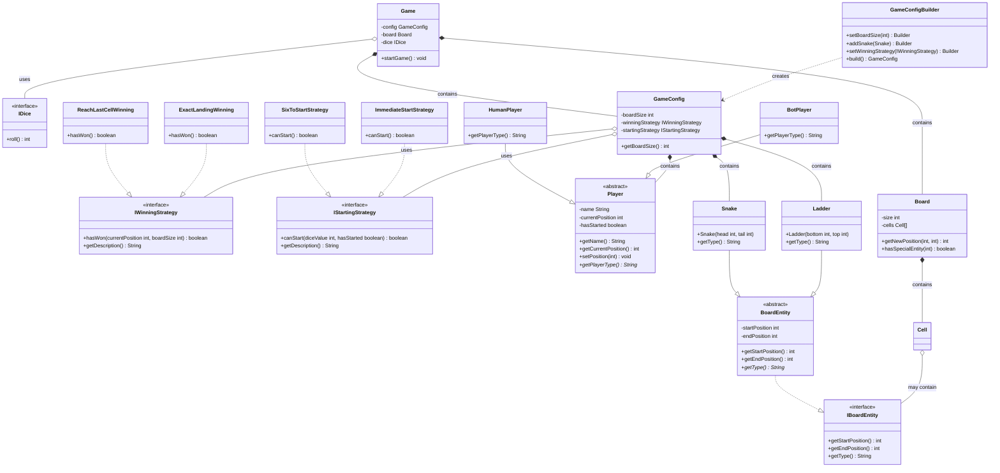

```mermaid
classDiagram
    %% Interfaces
    class IBoardEntity {
        <<interface>>
        +getStartPosition() int
        +getEndPosition() int
        +getType() String
    }
    
    class IWinningStrategy {
        <<interface>>
        +hasWon(currentPosition int, boardSize int) boolean
        +getDescription() String
    }
    
    class IStartingStrategy {
        <<interface>>
        +canStart(diceValue int, hasStarted boolean) boolean
        +getDescription() String
    }
    
    class IDice {
        <<interface>>
        +roll() int
    }

    %% Abstract Classes
    class BoardEntity {
        <<abstract>>
        -startPosition int
        -endPosition int
        +getStartPosition() int
        +getEndPosition() int
        +getType()* String
    }
    
    class Player {
        <<abstract>>
        -name String
        -currentPosition int
        -hasStarted boolean
        +getName() String
        +getCurrentPosition() int
        +setPosition(int) void
        +getPlayerType()* String
    }

    %% Concrete Classes
    class Snake {
        +Snake(head int, tail int)
        +getType() String
    }
    
    class Ladder {
        +Ladder(bottom int, top int)
        +getType() String
    }

    class HumanPlayer {
        +getPlayerType() String
    }
    
    class BotPlayer {
        +getPlayerType() String
    }

    class ReachLastCellWinning {
        +hasWon() boolean
    }
    
    class ExactLandingWinning {
        +hasWon() boolean
    }
    
    class SixToStartStrategy {
        +canStart() boolean
    }
    
    class ImmediateStartStrategy {
        +canStart() boolean
    }

    class Board {
        -size int
        -cells Cell[]
        +getNewPosition(int, int) int
        +hasSpecialEntity(int) boolean
    }
    
    class Game {
        -config GameConfig
        -board Board
        -dice IDice
        +startGame() void
    }
    
    class GameConfig {
        -boardSize int
        -winningStrategy IWinningStrategy
        -startingStrategy IStartingStrategy
        +getBoardSize() int
    }
    
    class GameConfigBuilder {
        +setBoardSize(int) Builder
        +addSnake(Snake) Builder
        +setWinningStrategy(IWinningStrategy) Builder
        +build() GameConfig
    }

    %% Inheritance Relationships
    BoardEntity ..|> IBoardEntity
    Snake --|> BoardEntity
    Ladder --|> BoardEntity
    
    HumanPlayer --|> Player
    BotPlayer --|> Player
    
    ReachLastCellWinning ..|> IWinningStrategy
    ExactLandingWinning ..|> IWinningStrategy
    
    SixToStartStrategy ..|> IStartingStrategy
    ImmediateStartStrategy ..|> IStartingStrategy
    
    %% Composition Relationships (Filled Diamonds)
    Game *-- GameConfig : contains
    Game *-- Board : contains
    Board *-- Cell : contains
    GameConfig *-- Snake : contains
    GameConfig *-- Ladder : contains
    GameConfig *-- Player : contains
    
    %% Aggregation Relationships (Empty Diamonds)  
    Game o-- IDice : uses
    GameConfig o-- IWinningStrategy : uses
    GameConfig o-- IStartingStrategy : uses
    Cell o-- IBoardEntity : may contain
    
    %% Dependencies (Dashed Arrows)
    GameConfigBuilder ..> GameConfig : creates
```